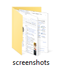

# Hotkey Screenshot

A lightweight Python tool for taking ordered screenshots using a keyboard shortcut.

It can be used for documentation, process walkthroughs, training materials, and guides.

## Installation

Install the required packages:

```bash
pip install pyautogui keyboard
```

## Usage

Run the script:

```bash
python hotkey_screenshot.py
```

Default controls:

- **F8** = Take screenshot
- **ESC** = Exit

Screenshots are automatically saved in a folder named `screenshots` and stored as:

```text
screenshot_001.png
screenshot_002.png
screenshot_003.png
...
```

## Custom Capture Region

By default, screenshots are taken of the entire screen.

To capture a specific area instead, uncomment and adjust the `region` parameter:

```python
pyautogui.screenshot(
    str(filename),
    region=(x, y, width, height)
)
```

## Example Output

Example screenshots generated by the tool:



The `screenshots` folder is created automatically when the first screenshot is taken:

screenshot_0.PNG

## License

This project is licensed under the MIT License. See the LICENSE file for details.
